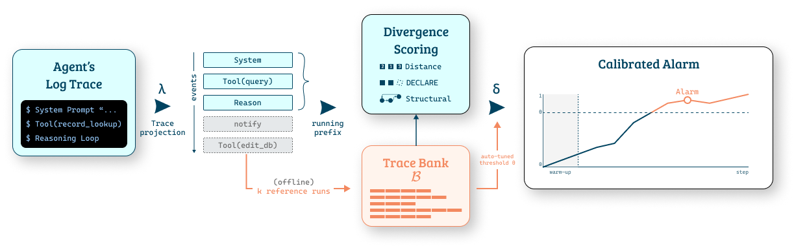

# TraceBank: Zero-Training Online Process Conformance Monitoring for AI Agents

Reproduction code for *"Zero-Training Online Process Conformance Monitoring for AI Agents"* (Panagiotopoulos et al.).



## Repository structure

```
tracebank/          Core library: events, distances, bank, detectors, DECLARE mining
scripts/            Reproduction pipeline (4 scripts, run in order)
data/               Pre-extracted tool-type annotations; trace files written here by Step 1
results/            Experiment output (JSON), written by Step 2
figures/            Paper figures (PDF + PNG), written by Step 3
vendor/
  tau-bench/        Git submodule — Sierra Research's tau-bench trajectories
  tau2-experiments/ Git submodule — tau2-bench logged trajectories
```

## Setup

### 1. Clone with submodules

```bash
git clone --recurse-submodules https://github.com/neron-png/datalab-tracebank.git
cd datalab-tracebank
```


### 2. Install dependencies

```bash
pip install -r requirements.txt
```


## Reproducing the paper

All commands are run from the repository root.

### Step 1 — Build the trace dataset

Project raw benchmark trajectories into the activity-label traces the detectors operate on.

```bash
python scripts/build_dataset.py
```

This reads the logged runs from `vendor/tau-bench/` and `vendor/tau2-experiments/` and writes one JSONL file per (model, domain, granularity) combination into `data/`.

To run only the tau-bench half (no tau2 data needed):

```bash
TB_BENCH=tau python scripts/build_dataset.py
```

### Step 2 — Run the experiment

Run the full detector sweep (13 detectors + step-count baseline, 3 bank sizes, 3 quantile levels, 10 seeds, 16 environments):

```bash
python scripts/run_experiment.py
```

This writes `results/e31_quantile_threshold_paper.json`. On a single core the sweep takes roughly 2–4 hours. Optional flags:

| Flag | Default | Description |
|------|---------|-------------|
| `--seeds N` | 10 | Number of independent bank draws |
| `--sources S [S ...]` | all 16 | Subset of environments to evaluate |
| `--raw` | off | Also dump per-seed values for each cell |

### Step 3 — Generate figures

```bash
python scripts/fig_detector_bars.py
python scripts/fig_detector_scatter.py
```

These read the JSON from Step 2 and write PDF and PNG files into `figures/`:

- `detector_f1_earliness.{pdf,png}` — Figure 2 in the paper (mean F₁ and earliness per detector)
- `detector_scatter_best.{pdf,png}` — Figure 1 in the paper (F₁ vs earliness at best configuration)
- `detector_scatter_overall.{pdf,png}` — overall scatter (all configurations averaged)
- `detector_scatter_domain.{pdf,png}` — per-domain scatter
- `detector_scatter_env.{pdf,png}` — per-environment scatter (4×4 grid)

## Environment variables

| Variable | Purpose |
|----------|---------|
| `TB_BENCH` | `tau`, `tau2`, or `all` (default). Controls which benchmarks are processed. |
| `TAU2_RESULTS` | Override the path to tau2 result files (defaults to the submodule location). |

## Benchmarks and data

This repository uses logged trajectories from two agentic benchmarks:

- **τ-bench** (Sierra Research): 4 corpora across 2 models × 2 domains. Included as a git submodule from [sierra-research/tau-bench](https://github.com/sierra-research/tau-bench).
- **τ²-bench**: 12 corpora across 4 models × 3 domains. Included as a git submodule from [neron-png/tau2-experiments](https://github.com/neron-png/tau2-experiments).

The 16 environments and their statistics are detailed in Table 1 of the paper.

## Citation

```bibtex
TBC
```
